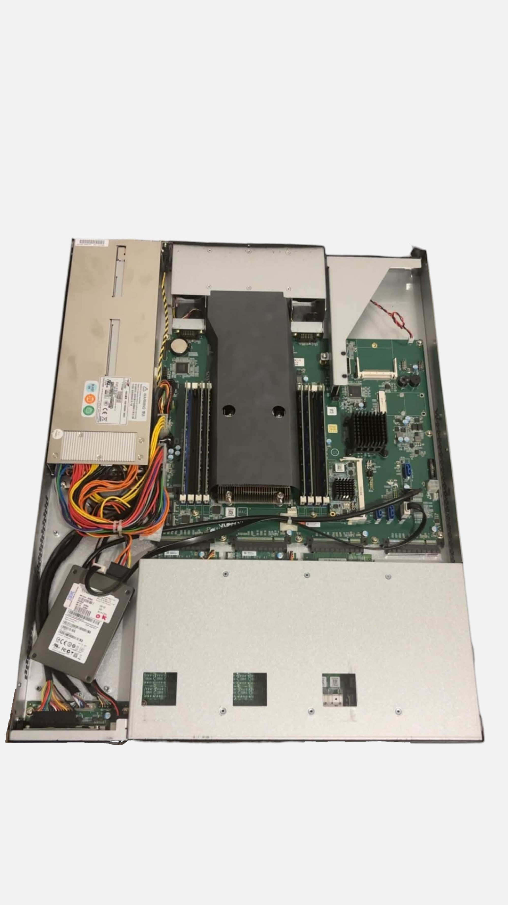

# 01 — Hardware

## Why this box?

€150 on eBay. For that price you get DDR4 memory, 12 threads and four SFP+ ports — nothing else in that range comes close. The only catch is the vendor firmware, and that's what OPNsense is for.

**Good to know:** there's no exotic hardware inside — Intel NICs, an Intel CPU and an AMI (American Megatrends) BIOS. It's a standard x86 server in a firewall chassis. The BIOS is vendor-customised, though, which is where most of the surprises come from (see [BIOS](03-bios.md)).

## Specifications of the documented unit

| Item | Value |
|---|---|
| Model / revision | Barracuda F800, revision `F CCE` <!-- CONFIRM on your unit + say where the label is --> |
| CPU | Intel Xeon E5-2620 v3 (6 cores / 12 threads, 2.4 GHz) |
| RAM | 24 GB DDR4 <!-- TO FILL: how many sticks, ECC or not, free slots --> |
| Storage as shipped | <!-- TO FILL: none / drive removed by seller --> |
| Storage installed | SATA drive <!-- TO FILL: capacity, 2.5" or 3.5" --> |
| Copper interfaces | <!-- TO FILL: how many, which controller --> |
| SFP+ interfaces | 4 × Intel <!-- TO FILL: exact controller, e.g. 82599 / X520 --> |
| Power supply | <!-- TO FILL: single or redundant --> |
| Console | Serial port <!-- TO FILL: RJ45 or DB9 --> |
| Price paid | €150 (eBay, used) |

## Opening the chassis

<!-- TO FILL:
     - screw type and where they are
     - which way the lid slides
     - anything that catches or needs force
     - whether a warranty seal has to be broken -->

## Storage

The unit arrived without a drive — a common situation with decommissioned appliances, since sellers usually pull the disk for data-protection reasons.

<!-- TO FILL:
     - drive format accepted (2.5" / 3.5", SATA)
     - is there a caddy / bracket / rack, or does the drive just sit in place?
     - were SATA and power cables already present, or did you have to add them?
     - minimum capacity worth using for OPNsense -->

## Networking

The four SFP+ ports are the main reason this box is worth the money at this price.

<!-- TO FILL:
     - which SFP+ modules were recognised
     - which ones were rejected (vendor locking?)
     - DAC cables: working or not
     - negotiated link speeds -->

Port-to-interface mapping is covered in [Networking](05-networking.md).

## Living with it

**Noise.** Rack-appliance cooling, designed for a datacentre rather than a living room. <!-- TO FILL: how loud in practice, does it quiet down after boot, did you swap the fans? -->

**Power draw.** <!-- TO FILL: measure it at idle and under load — this is a question people always ask -->

**Heat and mounting.** <!-- TO FILL: rack depth, standalone placement, ventilation clearance -->

## No video output

There is no usable video output during boot. Everything — BIOS, installer, first boot — goes through the serial console. This is the single biggest stumbling block for anyone new to these appliances, and it is covered in [Serial console access](02-serial-console.md).

## What you need before starting

- [ ] Console cable <!-- TO FILL: exact type -->
- [ ] USB-to-serial adapter
- [ ] USB stick for the installer (8 GB or more)
- [ ] A SATA drive
- [ ] Screwdriver <!-- TO FILL: type -->
- [ ] SFP+ modules or DAC cables, if you plan to use those ports
