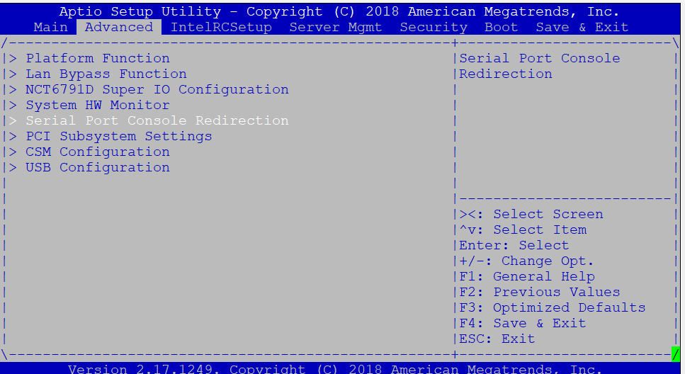
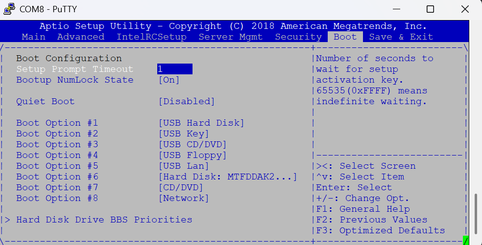

# 03 — BIOS

The F800 runs a standard **AMI (American Megatrends)** BIOS, but with vendor customisations. Nothing here is exotic — it just doesn't always behave the way a desktop BIOS would.

Everything in this chapter happens over the serial console. If you haven't got that working yet, start with [Serial console access](02-serial-console.md).

## Entering the BIOS

Connect at **19200 baud** — that's the Barracuda default, not the 115200 you'll use later with OPNsense. At the wrong speed you'll see garbled characters instead of the POST screen.

<!-- TO FILL:
     - which key to press (Del, F2, Esc?)
     - when exactly to press it, and for how long
     - is there a BIOS password on the Barracuda firmware? if so, what got you in -->

## Serial redirection settings

This is where you set the console speed. Aligning it with OPNsense saves you from reconnecting at a different baud rate every time you switch between BIOS and the running system.

!!! tip
    Set the baud rate to **115200** to match the OPNsense default.

<!-- TO FILL:
     - exact menu path (e.g. Advanced > Serial Port Console Redirection)
     - other settings in that menu: terminal type (VT100 / VT-UTF8 / ANSI),
       flow control, "Redirection After BIOS POST" — which values worked -->

## Boot order

Set USB first so the OPNsense installer starts. <!-- TO FILL: how the USB stick appears in the list — by brand name, as "UEFI: ...", as a generic entry? -->

<!-- TO FILL: is there a one-time boot menu (F11 / F12)? That's often easier
     than permanently changing the order -->

## Other settings worth checking

- [ ] **SATA mode** — <!-- TO FILL: AHCI or IDE? AHCI is what you want -->
- [ ] **Restore on AC power loss** — set to *Power On* so the firewall comes back by itself after an outage
- [ ] **UEFI / Legacy boot mode** — <!-- TO FILL: which one did you use, and did it matter for the OPNsense installer? -->
- [ ] **Watchdog / vendor-specific options** — <!-- TO FILL: anything Barracuda-specific in the menus? -->

## Once OPNsense is installed

Remember to put the boot order back to the internal drive, or the appliance will try to boot from any USB stick left plugged in.

## Pitfalls

<!-- TO FILL — this is the most valuable section of the chapter.
     Everything that cost you time, even if it seems obvious now:
     - anything that didn't behave as expected
     - settings that reset themselves
     - menus that don't render properly over serial
     - dead CMOS battery symptoms (settings lost at every power cycle) -->

---

Next: [Installing OPNsense](04-installation.md)
