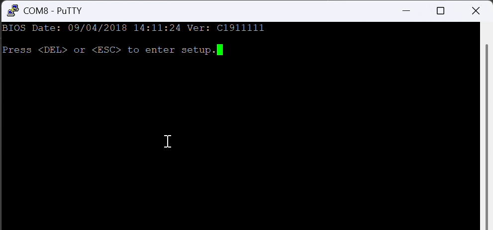
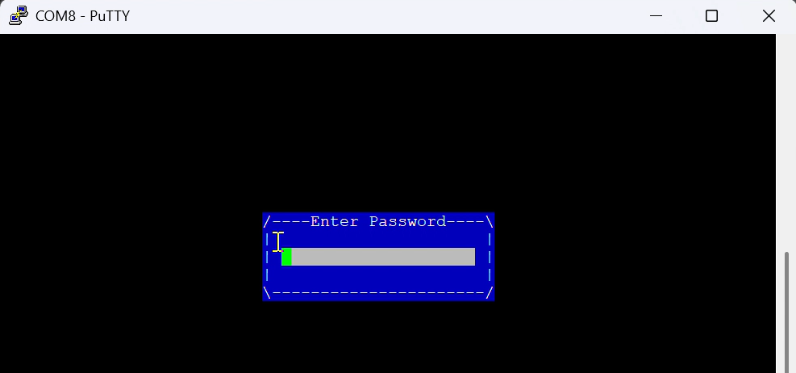
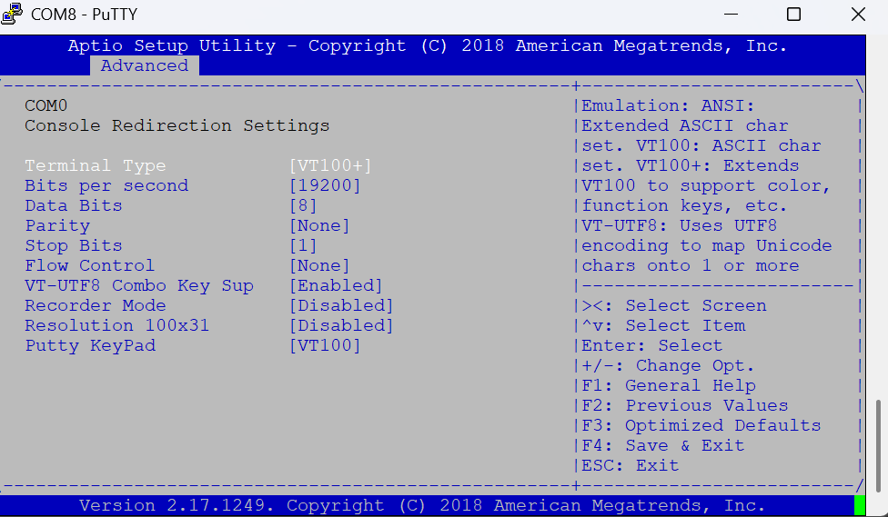

# 03 — BIOS

The F800 runs a standard **AMI (American Megatrends)** BIOS, but with vendor customisations. Nothing here is exotic — it just doesn't always behave the way a desktop BIOS would.

Everything in this chapter happens over the serial console. If you haven't got that working yet, start with [Serial console access](02-serial-console.md).

## Entering the BIOS

Connect at **19200 baud** — that's the Barracuda default, not the 115200 you'll use later with OPNsense. At the wrong speed you'll see garbled characters instead of the POST screen.

Press **DEL** or **ESC** at the boot

The BIOS may be password-protected. On this unit **bcndk1** worked. Others reported for Barracuda hardware: BCNDK1, 322232, 32232, ADMINBN99

## Serial redirection settings

This is where you set the console speed. Aligning it with OPNsense saves you from reconnecting at a different baud rate every time you switch between BIOS and the running system.

!!! tip
    Set the baud rate to **115200** to match the OPNsense default.
    Go into BIOS ADVANCED ---> Serial Port console redirection ---> bits per second 
    

## Boot order

Set USB first boot order in bios so the OPNsense installer starts. 

## Other settings worth checking

- [ ] **Restore on AC power loss** — set to *Power On* so the firewall comes back by itself after an outage
- [ ] **UEFI / Legacy boot mode** — I use UEFI boot mode. The BIOS is recent enough to support UEFI boot.

## Once OPNsense is installed

Remember to put the boot order back to the internal drive, or the appliance will try to boot from any USB stick left plugged in.

---

Next: [Installing OPNsense](04-installing-opnsense.md)
